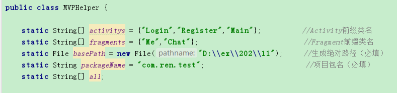
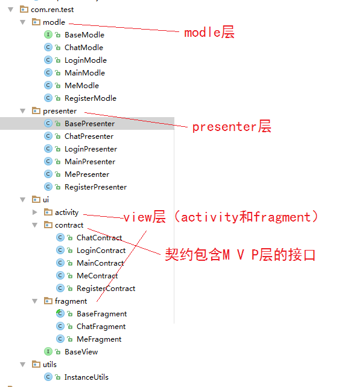
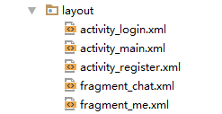

# MVPHelper
一键生成MVP框架，这是一个自动生成MVP框架的帮助类，可以配置生成的activity和fragment的实例，并且自动生成MVP三层的基类接口。

这里生成主要由四大模块：M\V\P\契约，V中包含activity、fragment和他们对应的布局资源。MVP三层中自动生成了对应的base类，所有的架子都搭好了，只需要写业务逻辑就可以了。

只需要配置如下信息：

点击执行后生成的目录如下：

生成的布局资源如下：

